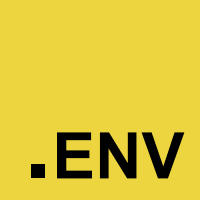

<h1 align="center">
  <a href="https://docs.dotenv.org"></a>
  <br>
  dotenv-vault
  <br>
</h1>

<h4 align="center">Sync environment variables, securely.</h4>

<p align="center">
  <a href="#usage">Usage</a>
  
  <a href="#commands" target="_blank">Commands</a>
  
  <a href="#contributing">Contributing</a>
  
  <a href="#changelog">Changelog</a>
</p>




dotenv-vault securely syncs secrets and app configuration across your machines, environments, and team members. Stop sharing .env files over insecure channels like Slack and email - from the same people that pioneered [dotenv](https://github.com/motdotla/dotenv).

[](https://npmjs.org/package/dotenv-vault)
[](https://npmjs.org/package/dotenv-vault)
[](https://github.com/dotenv-org/dotenv-vault/blob/master/package.json)
[](https://openbase.com/js/dotenv-vault?utm_source=embedded&amp;utm_medium=badge&amp;utm_campaign=rate-badge)
[](https://health.dotenv.org/)
[](https://health.dotenv.org/)

## Usage

Usage is similar to git. Run the command:

```bash
$ npx dotenv-vault new
```

Follow those instructions and then run:

```bash
$ npx dotenv-vault login
```

Then run push and pull:

```bash
$ npx dotenv-vault push
$ npx dotenv-vault pull
```

That's it!

Visit [dotenv.org/docs](https://www.dotenv.org/docs/getting-started/with-dotenv-vault) for a complete getting started guide.

## Commands

```
$ npx dotenv-vault
Sync environment variables, securely.

VERSION
  dotenv-vault/1.11.0 darwin-arm64 node-v18.3.0

USAGE
  $ dotenv-vault [COMMAND]

COMMANDS
  new       Create your project
  login     Log in to dotenv-vault
  logout    Log out
  open      Open project page
  push      Push .env securely
  pull      Pull .env securely
  versions  List version history
  whoami    Display the current logged in user
  status    Check dotenv-vault operational status
  help      Display help for dotenv-vault.
  update    update the dotenv-vault CLI
```

Visit [dotenv.org/docs](https://www.dotenv.org/docs/dotenv-vault) for details per command.

## Contributing

See [CONTRIBUTING.md](CONTRIBUTING.md)

### Development

Fork and clone the repo. Use `./bin/dev` to run local development commands.

```
./bin/dev new
./bin/dev push
./bin/dev pull
# etc
```

If you need to send the request to a different vault url, modify your command(s) to the following.

```
NODE_TLS_REJECT_UNAUTHORIZED=0 DOTENV_API_URL=https://vault.dotenv.development ./bin/dev
```

Note that dotenv-vault uses [oclif](https://oclif.io/).

### Testing

```
npm test
```

### Tarballs

* [https://dotenv-vault-assets.dotenv.org/](https://dotenv-vault-assets.dotenv.org/)
* [http://dotenv-vault.s3-website-us-west-1.amazonaws.com/](http://dotenv-vault.s3-website-us-west-1.amazonaws.com/)

### Publishing

Only for those with permission.

```
npm version patch
npm publish
```

Other notes.

```
npx oclif@3.0.1 pack tarballs
bash
env $(cat .env | xargs) npx oclif@3.0.1 upload tarballs
env $(cat .env | xargs) npx oclif@3.0.1 promote --version VERSION --sha SHA
```

## CHANGELOG

See [CHANGELOG.md](CHANGELOG.md)
